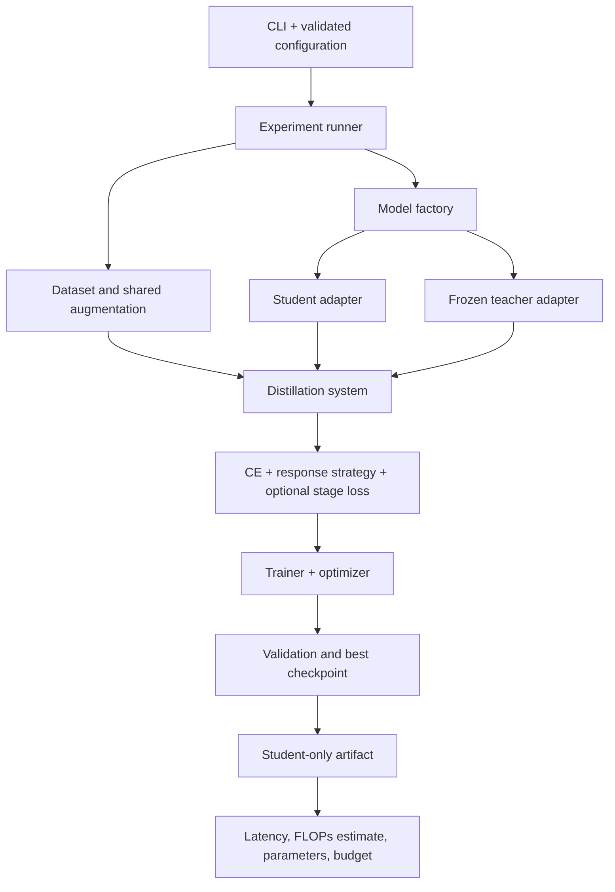

# Design and guideline coverage

The project uses a small set of explicit interfaces and composition. Architecture selection, data construction, objective selection, training, and experiment policy are separate so adding a loss does not require rewriting the trainer.

## Responsibilities and patterns

| Component | Design pattern and responsibility |
|---|---|
| `config.py` | Frozen dataclasses hold explicit, validated configuration. Unknown fields fail instead of silently being ignored. |
| `models.py` | **Adapter**: `VisionModel` returns `ModelOutput(logits, features)` and declares stage widths. **Factory**: `create_model` is the architecture selection boundary. |
| `losses.py` | **Strategy**: independent `LogitsKD` and `DecoupledKD` modules. **Composition**: `DistillationObjective` combines a supervised loss strategy, a response strategy, and optional `StageFeatureLoss`. |
| `adaptive_focal.py` | **Strategy and composition**: AdaFocal/AdaDualFocal supervised loss with a validation feedback controller. Controller state is checkpointed as buffers; it adds no inference parameters. |
| `cpc.py` | **Strategy and composition**: fixed binary-discrimination and exclusion terms injected separately from the MMCE controller; normalized pairwise constraints add no inference parameters. |
| `calibration_metrics.py` | Pure probability diagnostics, tie-aware ranking and conditional calibration-null references; shared by evaluation and study reporting. |
| `cpc_study.py` | Matched six-run protocol, validation-only temperature fitting and test-access gates; reuses the existing training engine. |
| `data.py` | Builds split-aware datasets and deterministic loaders. Teacher and student share the resulting tensor. |
| `engine.py` | **Dependency injection**: `Trainer` receives a system, optimizer, and device. `DistillationSystem` owns teacher lifecycle. `run_experiment` constructs dependencies and manages artifacts. |
| `checkpoints.py` | Artifact serialization, atomic file replacement, compatibility checks, RNG recovery, and teacher hashing. |
| `metrics.py` | Evaluation, confidence/calibration, measured inference latency, operation estimates, and deployment-budget checks. |
| `experiments.py` | Ablation policy and result comparison; no architecture-specific training code. |
| `cifar_study.py` | Predeclared repeated-seed study; resumes training runs, freezes validation selection, then unlocks the held-out test phase. |
| `evaluation.py` | Detailed prediction metrics, uncertainty intervals, paired comparisons, and probability archives. |
| `reporting.py` | Reads completed artifacts and renders Markdown/CSV reports and standalone scientific plots. |
| `cli.py` | Argument parsing and presentation; no loss implementation. |

There are no global configuration singletons, dynamic plugin registries, or inheritance layers for individual experiment recipes. PyTorch registers all feature projections before optimizer construction. Teacher parameters are frozen and excluded from optimizer parameter groups; `DistillationSystem.train()` keeps the teacher in evaluation mode so BatchNorm buffers also remain fixed. Teacher forward passes use `no_grad`, and losses additionally detach teacher tensors when called independently.

## Mapping the guidelines to behavior

| Guideline | Implementation |
|---|---|
| 1. Strong logits baseline | Supervised and classical KD strategies; full temperature/weight grid; correct batch-mean KL and `T²` scaling. |
| 2. DKD first upgrade | Separate target/rest and conditional non-target KL terms, configurable alpha/beta/weight, optional warmup. |
| 3. Capacity gap and assistants | Explicit teacher selection, capacity-ratio report, compatible student artifacts reusable as teachers, assistant configuration. |
| 4. Teacher confidence and errors | Teacher validation accuracy, NLL, entropy, confidence on correct/incorrect examples, and 15-bin ECE; no correctness filtering. |
| 5. Consistent strong augmentation | A single shared image tensor; controlled basic/strong augmentation ablation; configurable reflection. |
| 6. Feature transfer after logits | Optional explicit stage pairing with channel/spatial alignment; adaptive feature experiment starts from the best DKD hyperparameters and a fresh student. |
| 7. Dense prediction | Explicitly unsupported by this classification pipeline. A dense task requires spatial/foreground losses and task metrics; the configuration and logits-loss shape contracts reject substituting this classifier for one. |
| 8. Architectural differences | Adapters expose named feature stages; projections align differing channels/resolutions. ViT token alignment and dedicated distillation tokens need a transformer adapter. |
| 9. Controlled comparisons and cost | 21-variant study, fixed seed and initial student, validation selection, held-out test command, parameters/FLOPs estimate/latency/training overhead, budget-aware final selection. |

## Numerical choices

Classical KD computes `KL(p_teacher || p_student)`, not the reverse. Teacher softmax and student log-softmax use the same temperature. KL is summed over classes and averaged over examples, matching PyTorch's `batchmean` convention.

For DKD, the two target/rest logits are the target logit and `logsumexp` of the other logits. Applying log-softmax to these produces the exact aggregated distribution without subtracting a rounded target probability from one. The non-target distribution removes the target entry before softmax. This avoids an arbitrary mask constant and undefined zero-times-infinity terms at high confidence. Two-class NCKD naturally becomes zero. Loss calculations use float32 to avoid half-precision underflow.

Stage alignment uses user-specified pairs; equal ordinal names alone do not prove semantic equivalence between unrelated networks. Inspect the model stages and adjust the mapping when using a new architecture. Projections and the teacher are training dependencies and are absent from `student.pt`.

## Adding a model or dense task

For another classifier, implement `VisionModel.forward(images, return_features=False)`, return raw `[N, C]` logits, declare named `feature_channels`, and add a constructor to `create_model`. Match class ordering and preprocessing to the teacher; a shape match alone is insufficient. A feature adapter for a transformer must decide how to handle tokens, patch layout, special tokens, and semantic stage matching rather than reshaping arbitrary tensors.

For segmentation, introduce a dense output contract, paired image/mask augmentation with nearest-neighbor mask interpolation, valid/ignored-pixel handling, spatial response/attention or relational losses, and mIoU evaluation. For detection, introduce a detector adapter that exposes task losses, aligned regions or foreground features, geometric box augmentation, and a validated mAP evaluator. Dense feature losses must distinguish foreground, background, and ignored regions. These are explicit future integrations because the workspace supplied no dense dataset or model pair; there is no hidden fallback to global classification KD.

## Validation

`python -m unittest discover -s tests -v` uses only the standard library test runner and the existing ML packages. Tests cover independent probability calculations for both response losses, temperature scaling, warmup/weight conventions, binary/extreme-confidence stability, teacher gradient isolation, incorrect-teacher examples, feature alignment gradients, shared augmentation, fixed BatchNorm state, optimizer updates, adapter contracts, class metadata validation, export/evaluation, budget-constrained ablations, and exact epoch-boundary CPU recovery after an injected interruption.

`python -m kd smoke` additionally executes a trained synthetic teacher plus all 21 student variants. Synthetic runs are labeled in machine-readable reports. No claim about real driving accuracy or KD improvement follows from this smoke test.

## Primary references

- Hinton, Vinyals, and Dean, [Distilling the Knowledge in a Neural Network](https://arxiv.org/abs/1503.02531).
- Zhao et al., [Decoupled Knowledge Distillation, CVPR 2022](https://openaccess.thecvf.com/content/CVPR2022/html/Zhao_Decoupled_Knowledge_Distillation_CVPR_2022_paper.html) and [the authors' implementation](https://github.com/megvii-research/mdistiller/blob/master/mdistiller/distillers/DKD.py). The response objective follows their formulation; this implementation uses log-space aggregation and removes target entries for numerical stability.
- PyTorch, [KLDivLoss documentation](https://docs.pytorch.org/docs/stable/generated/torch.nn.KLDivLoss.html), for KL direction, log-probability inputs, and batch-mean reduction.
- torchvision, [ResNet-18 model documentation](https://docs.pytorch.org/vision/stable/models/generated/torchvision.models.resnet18.html), for the model API and standard ImageNet normalization.
- The remaining research references are preserved in [the supplied guidelines](../knowledge-distillation-guidelines.md). Optional methods such as ReviewKD, structured detector KD, and DeiT are not claimed as reproduced implementations.
